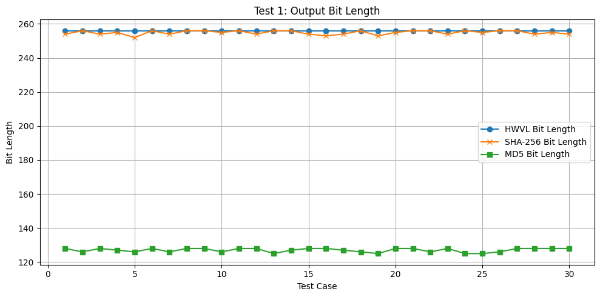
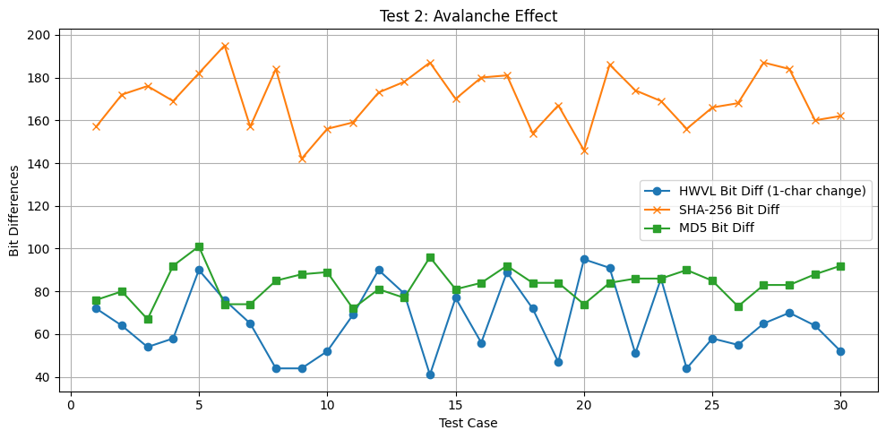
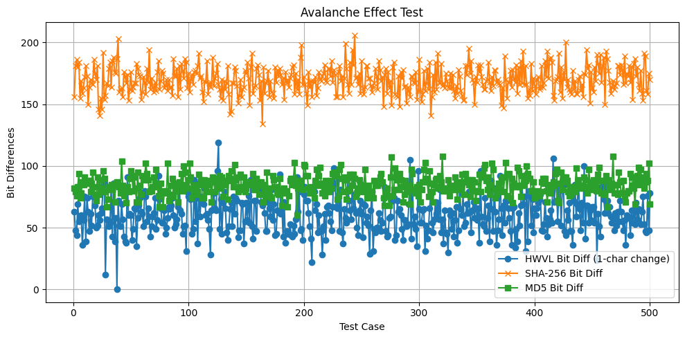
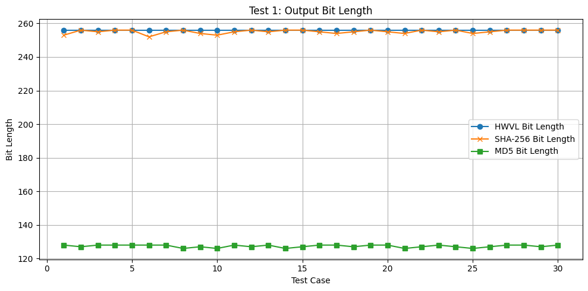
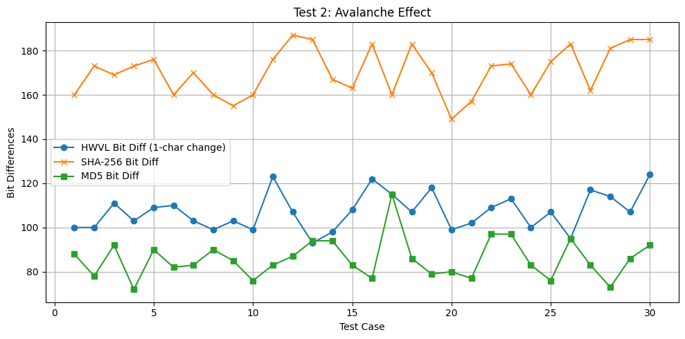
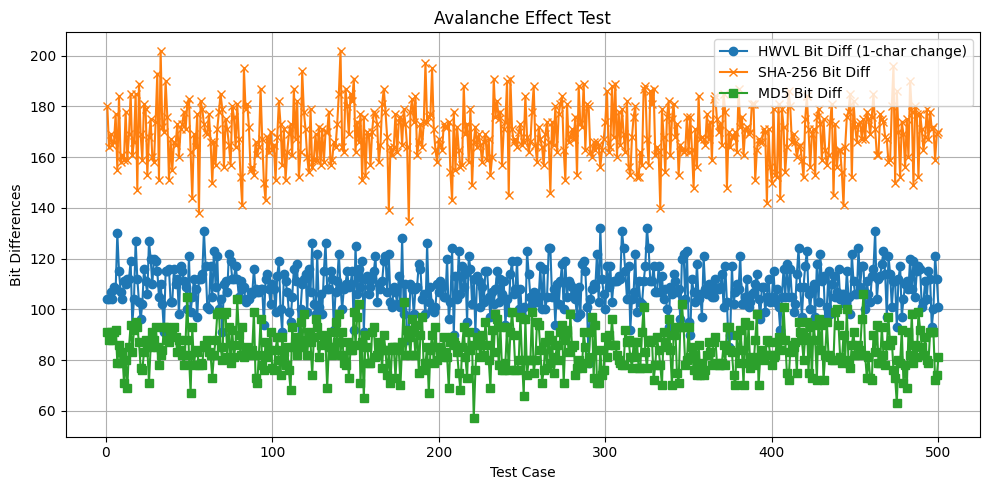

# HWVL اولین هش ایرانی
### **قبل از معرفی HWVL بیایید بررسی کنیم که اصلا هش و هشینگ یعنی چه و چه کاربردی دارد**

---

### هش

تابع هش، یک تابع ریاضی است که ورودی با طول دلخواه را گرفته و خروجی با طول مشخص تولید می کند 

---

#### ✅ قطعی بودن
تابع هش در ازای یک ورودی مشخص، همواره مقدار هش ثابتی ارائه می‌دهد. یعنی اگر یک مقدار را چندین بار در تابع قرار دهید، خروجی همیشه یکسان خواهد بود.  
این ویژگی باعث می‌شود که پیگیری و بررسی داده‌ها آسان‌تر باشد. در غیر این صورت، کاربران با انبوهی از خروجی‌های متفاوت برای یک ورودی مواجه می‌شدند که تحلیل آن‌ها دشوار و زمان‌بر بود.

---

#### ⚡ سرعت بالا در محاسبه
تابع هش باید بتواند مقدار ورودی را در مدت‌زمان کوتاه به خروجی تبدیل کند.  
اگر سرعت این فرآیند پایین باشد، عملکرد کلی سیستم نیز کاهش می‌یابد و ناکارآمد خواهد بود.

---

#### 🔒 یک‌طرفه بودن

تابع هش رمزنگاری یک تابع یک‌طرفه است؛ یعنی:
- به‌راحتی می‌توان از ورودی به خروجی رسید،
- اما انجام عملیات معکوس (یعنی رسیدن از خروجی به ورودی) بسیار دشوار و در عمل غیرممکن است.

برای مثال اگر دامنه‌ی کوچکی مانند اعداد ۵ تا ۱۰ را به تابع بدهیم، ممکن است بتوان با آزمون و خطا ورودی را از خروجی بازسازی کرد. اما در دامنه‌های بزرگ‌تر، این فرایند زمان‌بر، بی‌نتیجه و عملاً غیرممکن است.

در این حالت، تنها روش ممکن **جستجوی جامع (brute-force)** است که شامل امتحان تمام ورودی‌های ممکن به‌صورت تصادفی است. این روش بسیار پرهزینه و ناکارآمد است و به همین دلیل به آن "بی‌خردانه" نیز گفته می‌شود.

---

#### 🌀 تغییر کامل خروجی با تغییر کوچک در ورودی
کوچک‌ترین تغییر در ورودی باعث ایجاد تغییر کامل در خروجی هش می‌شود.  

برای مثال، هنگام وارد کردن رمز عبور، اگر حتی یکی از کاراکترها تغییر کند، خروجی هش تغییر کرده و سیستم دیگر اجازه‌ی ورود نمی‌دهد.  
این ویژگی برای تشخیص صحت داده بسیار کلیدی و حیاتی است.

---

#### 🎯 یکتابودن مقدار هش برای هر ورودی
هر ورودی دارای یک هش منحصر‌به‌فرد است.  
یعنی امکان ندارد که دو ورودی متفاوت، خروجی هش یکسانی تولید کنند.

به‌عبارت دیگر:
> اگر `A ≠ B` باشد، آنگاه `Hash(A) ≠ Hash(B)` نیز برقرار است.

این ویژگی مانع بروز تصادم (collision) در سیستم‌های امنیتی و رمزنگاری می‌شود.

---

#### 📏 ثابت بودن طول خروجی
تابع هش بدون توجه به اندازه ورودی، همواره خروجی با طول ثابت تولید می‌کند.  

برای مثال:
`"سلام"`و
`"سلام خوبی"`
هر دو اگر به تابع هش داده شوند، خروجی‌هایی با طول دقیقاً یکسان تولید خواهند کرد.
این خاصیت باعث می‌شود که فضای ذخیره‌سازی بهینه باشد و پردازش‌ داده‌ها با سرعت و نظم بیشتری انجام شود.

---

### کاربرد الگوریتم های هش

زمانی که درون وب سایتی ثبت نام می کنید و یک رمز برای خود مشخص می کنید یا حتی زمانی که پسورد لاگین ویندوز را وارد می کنید رمز ورودی شما با تابع هش تبدیل به متن رمز شده می شود و درون ان برنامه یا وب سایت ذخیره می شود این گونه اگر کسی بخواهد رمز شما را به دست اورد و بخواهد ان را بشکند مثل یک قفل محکم است که هر چه رمز شما قوی تر باشد این قفل هم قوی تر است. خب شاید برای شما سوال شود که وب سایت یا برنامه چگونه می فهمد که رمزی که من وارد کرده ام درست است چون همان طور که گفتیم تقریبا غیر ممکن است؟

وب سایت ها رمز جدیدی که وارد کرده اید را به همان تابعی می دهند که قبلا از ان برای قفل کردن پسورد شما استفاده کرده بودند و این تابع دوباره ان رمز جدید را هش می کند بعد وب سایت یا برنامه هش این رمز جدید را با همان هش قبلی که ذخیره شده بود مقایسه می کند و اگر برابر بودند وارد برنامه یا وب سایت می شوید.با این تکنیک حتی اگر وب سایت هک شود رمز شما در امان خواهد بود

# HWVL


__HWVL__ مخفف __Hash With Variable Length__
به معنی هش با طول متغیر است

این هش بر خلاف هش های دیگر دو مقدار می گیرد   
- متنی که می خواهد هش کند
- طول خروجی

طول خروجی علاوه بر مشخص کردن تعداد کاراکتر های خروجی در الگوریتم تاثیر فراوانی دارد هر چه این مقدار کمتر باشد احتمال برخورد بیشتر و سرعت هم بیشتر می شود و هر چه این مقدار بیشتر باشد باعث سخت شدن شکستن هش و کمتر شدن احتمال برخورد و کمتر شدن سرعت الگوریتم می شود.

یعنی این عدد رابطه مستقیم با امنیت الگوریتم دارد🔒

این الگوریتم دو نسخه دارد ما می خواهیم الگوریتم را با sha256 و md5 مقایسه کنیم تست های صورت گرفته به شرح زیر است

| تست            | توضیح                                                            |
| -------------- | ---------------------------------------------------------------- |
| **Bit Length** | بررسی می‌کنه که خروجی HWVL چقدر طول متغیر داره نسبت به SHA و MD5 |
| **Avalanche**  | بررسی میزان تغییر بیت در برابر تغییر ۱ کاراکتر در ورودی          |
| **Collision**  | بررسی احتمال تکرار خروجی (برای ورودی‌های تصادفی)                 |

>### __توجه کنید تمام ازمایش های با طول خروجی پیش فرض HWVL گرفته شده است__

#  نتایج نسخه اول



30بار تست:


500بار تست:


و هیچ برخوردی در 10000 تست صورت نگرفت

# نتایج نسخه دوم



30بار تست:


500بار تست:


و هیچ برخوردی در 10000 تست صورت نگرفت

البته برای نسخه دوم با توجه با اهمیت برخورد من به صورت جداگانه 10,000,000 تست گرفتم ولی هیچ برخوردی پیدا نشد

# نحوه استفاده

ابتدا مخزن را دانلود کنید. سپس کد های HWVL مورد نظر خود را کنار برنامه اصلی بگذارید و ان را به صورت ماژول وارد برنامه کنید مثلا اگر نسخه HWVL شما نسخه دوم است از کد زیر استفاده کنید:

```python
from HWVL2 import HWVL
print(HWVL("hello",20))

```
یا 

```python
from HWVL2 import HWVL
print(HWVL("hello"))

```

نسخه یک هم به همین صورت است

```python
from HWVL1 import HWVL
print(HWVL("hello"))

```
>### نکته: اگر به تابع مقدار دوم را ندهید به صورت پیش فرض طول ان 32 کاراکتر است

<br>

# الگوریتم اثبات کار جدید با HWVL
به لطف بیت کوین احتمالا همه شما با الگوریتم های اثبات کار اشنا هستید ولی برای کسانی که اشنایی ندارند به طور ساده الگوریتم های اثبات کار شبیه یک مساله ریاضی خیلی پیچیده است که از ان برای جلو گیری از جعل اطلاعات و افزایش امنیت استفاده می شود

ما به کمک HWVL توانستیم بین دو سیستم در شبکه lan یک ارتباط با اثبات کار پیاده سازی کنیم.اثبات کار به این صورت بود که کلاینت یک درخواست اتصال به سرور همراه با یک کلید عمومی می زد و سرور در پاسخ یک متن تصادفی با طول n(که سختی شبکه است)تولید می کرد و با  HWVL(key,40) و کلید عمومی رمز می کرد و می فرستاد

سپس کلاینت سعی می کرد ان را بشکند و متن اصلی را پیدا کند بعد از این کار با تابع HWVL(key) یک هش 32 کاراکتری می شاخت و به سرور می داد و سرور هم در پاسخ به او می گفت که ایا کرک هش او موفق امیز بوده است یا نه که اگر نه کلاینت دوباره این کار را انجام دهد

بعد از تایید سرور کلاینت و سرور توسط همان کلیدی که بین هم توافق کرده بودند شروع به رمزنگاری با کلید متقارن می کردند.  
از انجایی که همه ارتباط با رمزنگاری نا متقارن صورت می گرفت ارتباط امن بود

### مزیت

مزیت این روش نسبت به روش های دیگر مثل دیفی هالمن جلو گیری از حمله dos بود که اگه کلاینت بخواهد به سرور حمله کند نتواند به راحتی ارتباط ایجاد کند و بیشتر از اینکه سرور را مشغول کند خودش مشغول کرک کردن هش می شود 

---

برای مشارکت در توسعه این پروژه به این ایمل پیام دهید:`mohammad.rakhshkhorshid@gmail.com`  
امیدوارم که موفق باشید😊


---
منابع:  
`https://wallex.ir/blog/%D8%AA%D8%A7%D8%A8%D8%B9-%D9%87%D8%B4-%D8%A8%D9%87-%D8%B2%D8%A8%D8%A7%D9%86-%D8%B3%D8%A7%D8%AF%D9%87/`

---

کد نویس:محمد رخش خورشید  
سال تولید:1403-1404